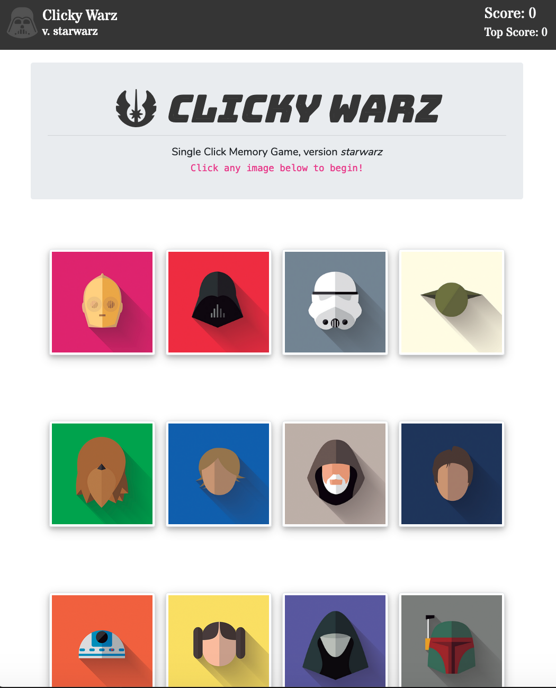

# clickywarz
This is a react app using components to create a memory click game! 

# Instructions
Click each character only one time, duplicate clicks will result in a loss. The character tile order will be randomized after each click, so try to remember which characters you have chosen! Good luck. 
- Deployed to heroku: https://polar-sea-38119.herokuapp.com/

## Getting started
- clone repo
- start react app
- use local port specified

open console: 
- ```git clone https://github.com/msesno/clickywarz.git``` <br>
- ```cd clickywarz``` <br>
- ```npm start```

### Front-end
- HTML, CSS (Bootstrap)
- Javascript (JQuery)
- FontAwesome/GoogleFonts
- tile images generic from Google

### Back-end
- JavaScript (JQuery)
- React App
- NPM Run Build
- deployed to heroku

### Links
- Repository: https://github.com/msesno/clickywarz/
- Deployed site: https://polar-sea-38119.herokuapp.com/

### Screenshot
<br>